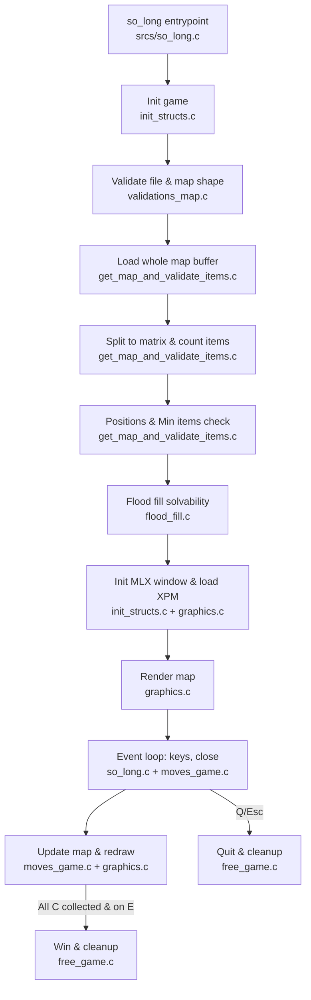
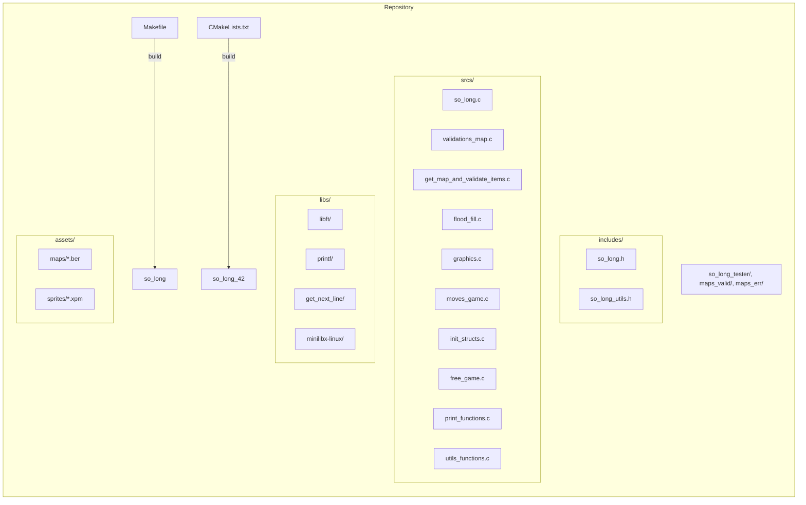

# so_long — 2D Game with MiniLibX (42 School)

A small 2D tile-based game built for 42 School using MiniLibX. The project focuses on window management, rendering sprites, map parsing/validation, event handling, and basic game logic.

The player must collect all collectibles and reach the exit on a valid, walled, rectangular map.

## Features

- Map parsing and validation (rectangular, walls, items, solvable path via flood-fill)
- Rendering with MiniLibX (X11) using XPM sprites
- Player movement with WASD/Arrow keys, move counter, exit on Q/Esc
- Error handling and resource cleanup

## Requirements

Tested on Linux with X11. You need a C toolchain and X11 dev libraries.

- GCC or Clang, Make
- X11 development libs: X11, Xext, Xpm, Xrandr
- zlib (used by MiniLibX)

On Debian/Ubuntu:

```bash
sudo apt update && sudo apt install -y \
  build-essential cmake git \
  libx11-dev libxext-dev libxpm-dev libxrandr-dev zlib1g-dev
```

## Build

This project supports two build systems: Makefile (default) and CMake (optional).

### Option 1: Makefile (recommended)

```bash
make
```

This will:
- Build third-party libraries in `libs/` (libft, printf, get_next_line, minilibx-linux)
- Compile the game into `so_long`

AddressSanitizer is enabled by default via `-fsanitize=address`. To disable it, remove that flag from `CFLAGS` in `Makefile`.

Clean targets:

```bash
make clean    # remove objects
make fclean   # clean + remove binary
make re       # rebuild from scratch
```

### Option 2: CMake (CLion-friendly)

```bash
cmake -S . -B build
cmake --build build -j
```

The binary will be created at `build/so_long_42` (name per CMakeLists). It also compiles MiniLibX and links X11.

## Run

Usage:

```bash
./so_long PATH_TO_MAP.ber
# or, if built with CMake
./build/so_long_42 PATH_TO_MAP.ber
```

Examples:

```bash
./so_long assets/maps/exemple_map.ber
./so_long assets/maps/map_01.ber
```

Controls:
- W / Arrow Up: move up
- A / Arrow Left: move left
- S / Arrow Down: move down
- D / Arrow Right: move right
- Q / Esc: quit

You win by collecting all collectibles and entering the exit tile.

## Map Format (.ber)

Maps are ASCII text files with the following constraints:

- Rectangular grid delimited by newlines
- Only these characters are allowed:
  - `1`: wall
  - `0`: floor
  - `P`: player start (exactly one)
  - `E`: exit (exactly one)
  - `C`: collectible (at least one)
- The map must be fully walled: first/last rows all `1`, and first/last column per row must be `1`
- The map must be solvable: there exists a path from `P` to all `C` and to `E` (checked via flood-fill)

See examples:
- Valid: `maps_valid/`
- Invalid: `maps_err/` and `so_long_tester/maps/invalid/`

## Project Structure



Key directories and files:



## Testing

There are multiple ways to test maps and behavior:

- Manual run with provided maps (see `assets/maps/`, `maps_valid/`, `maps_err/`):

```bash
./so_long maps_valid/ok.ber
./so_long maps_err/no_walls.ber   # should error
```

- Root helper script:

```bash
./map_tester.sh  # may run a batch of maps if implemented
```

- External tester in this repo:

```bash
make -C so_long_tester
./so_long_tester/check            # see so_long_tester/README.md
```

The program prints clear error messages and exits on invalid maps. During gameplay it prints the move count, and on quit/win it frees resources and closes the window.

## Troubleshooting

- If linking errors mention X11/Xext/Xpm, install the dev packages listed in Requirements
- If you get an error creating images or windows, ensure X server is available (run inside a desktop session or with proper DISPLAY)
- AddressSanitizer is enabled; crashes will print detailed reports. Disable by removing `-fsanitize=address` in Makefile/CMake if needed
- If sprites do not appear, verify the `.xpm` paths under `assets/sprites/` exist as defined in `includes/so_long_utils.h`

## License

Educational project for 42 School. Sprites are included for learning purposes.
